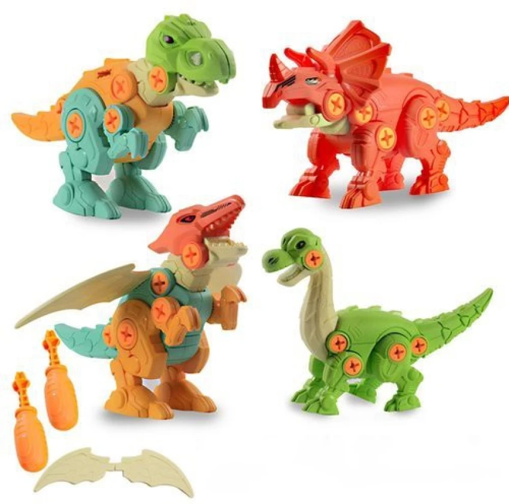
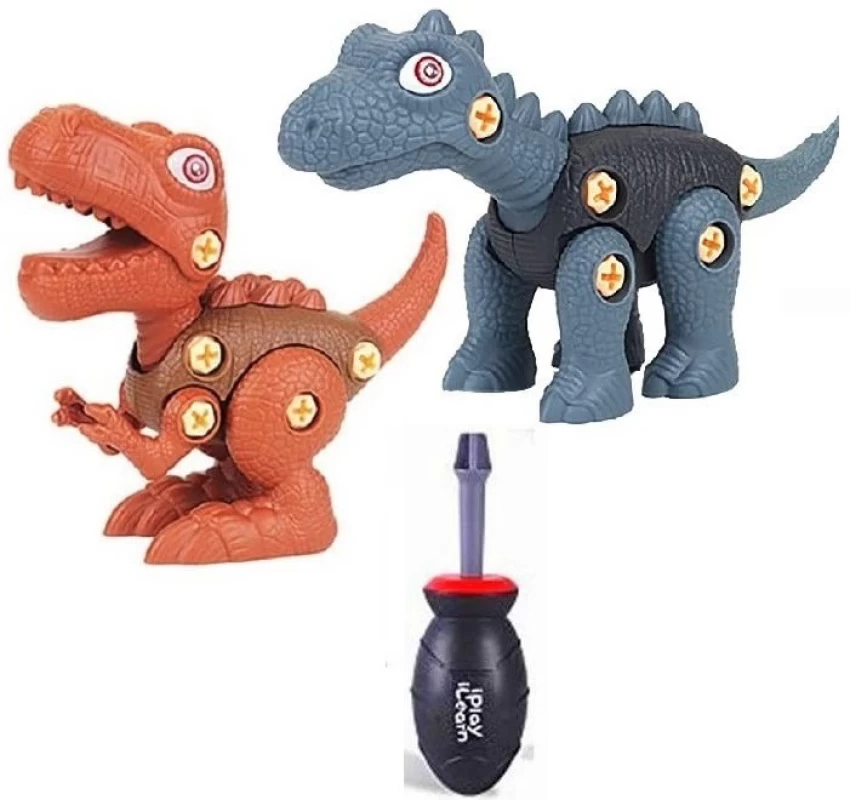
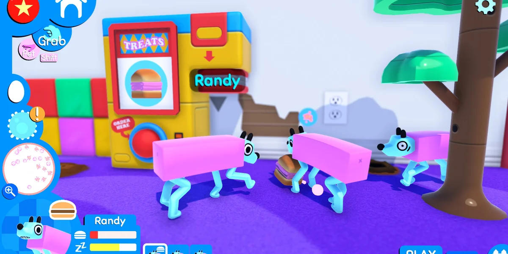
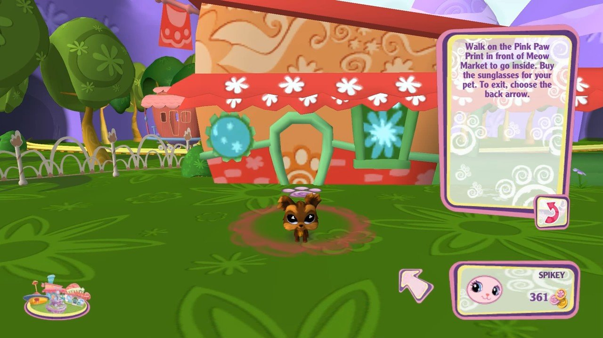
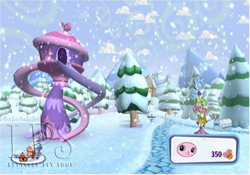
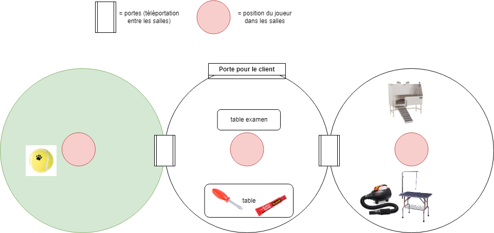
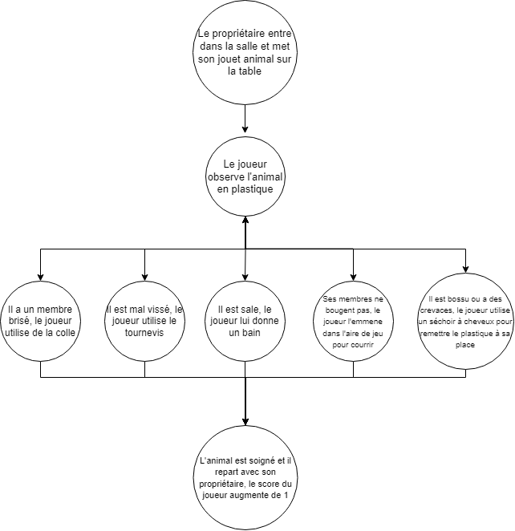

# VR_projet_final

## Résumé en une phrase 

Ce jeu de réalité virtuelle destiné aux enfants permet aux joueurs d'endosser le rôle de vétérinaire pour jouets en examinant, réparant et prenant soin d'animaux en plastique dans trois salles distinctes, avec des réparations variées et la possibilité de gagner des points.

## Description écrite de la proposition 
Dans ce jeu de réalité virtuelle spécialement conçu pour les enfants, les joueurs incarnent un vétérinaire pour jouets. Les clients arrivent avec des animaux en plastique qu'ils posent sur la table d'examen de la salle centrale. Le joueur a la tâche d'examiner l'animal et d'identifier les problèmes. Le jeu se déroule dans trois salles différentes, chacune offrant des options de réparation et de soin uniques.

La salle du milieu est l'espace de diagnostic et de réparation, équipée d'une table d'examen. Les jouets peuvent présenter des problèmes tels que des membres lâches, des fractures ou des bosses. Pour résoudre ces problèmes, le joueur a accès à un tournevis pour resserrer les membres lâches et de la colle forte pour réparer les fractures.

Dans la salle de droite, il y a une baignoire pour animaux et une table avec un sèche-cheveux. Les jouets peuvent être lavés dans le bain s'ils sont sales, et le sèche-cheveux peut être utilisé pour réchauffer le plastique et réparer des crevasses ou des bosses. C'est l'endroit où les jouets retrouvent leur éclat d'origine.

La salle de gauche est une salle de jeu en plein air où le joueur peut interagir avec les animaux en lançant une balle pour les faire courir et débloquer leurs jointures, ajoutant ainsi une touche amusante au processus de réparation.

Le jeu propose une variété d'animaux en plastique avec des formes et des couleurs aléatoires, offrant aux joueurs une expérience de jeu diversifiée. Chaque fois qu'un joueur soigne avec succès un animal, il gagne un point, ajoutant une dimension compétitive au jeu. C'est une expérience immersive qui encourage les enfants à développer des compétences de résolution de problèmes tout en s'amusant.

### Motricité fine et globale de l'enfant

- Tourner un petit tournevis nécessite une motricité fine, aidant à améliorer la coordination main-œil et la dextérité des doigts de l'enfant.

- L'application de colle à des endroits spécifiques sollicite également la motricité fine et la précision dans le mouvement.

- Déplacer l'animal implique une combinaison de motricité fine et globale, car l'enfant doit utiliser ses mains pour manipuler l'objet tout en coordonnant ses mouvements avec son corps pour le placer correctement.

- Laver l'animal dans tous les sens stimule la coordination main-œil et la motricité globale, car l'enfant doit utiliser ses mains pour tenir l'animal et le bouger tout en surveillant les mouvements dans l'espace virtuel.

- Lancer des balles dans le jeu encourage la motricité globale, en particulier la coordination des membres supérieurs et inférieurs, renforçant ainsi les compétences en lançant et en visant.

- Utiliser un sèche-cheveux pour chauffer le plastique et éliminer les bosses renforce la coordination main-œil, la dextérité des doigts et la concentration de l'enfant.

## Un moodboard visuel 

## Un moodboard visuel 

[mao](https://github.com/Jasmine-Lapierre/VR_projet_final/blob/main/assets/sons/Mio%20mao%20~%20sped%20up🫰🏻.mp3?raw=true)

[Chrysalis](https://github.com/Jasmine-Lapierre/VR_projet_final/blob/main/assets/sons/%5BWobbledogs%20OST%5D%201%20-%20Chrysalis.mp3?raw=true)

[angry birds 1](https://github.com/Jasmine-Lapierre/VR_projet_final/blob/main/assets/sons/Angry%20Birds%202-%20All%20King%20Pig%20Sounds.mp3?raw=true)

[angry birds 2](https://github.com/Jasmine-Lapierre/VR_projet_final/blob/main/assets/sons/Angry%20Birds%202-%20All%20Bubbles%20Bird%20Sounds.mp3?raw=true)

## Une carte de votre environnement virtuel 

## Un schéma de programmation ou d'interactivité

